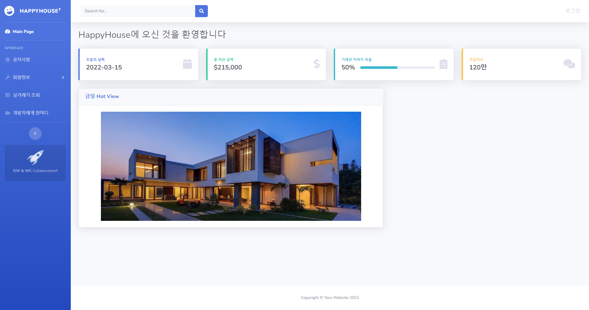
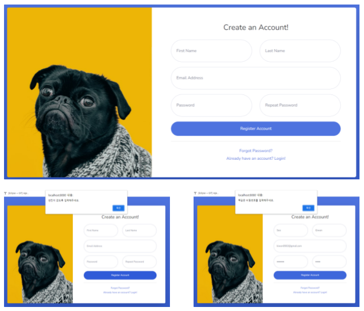

# HappyHouse

# Memeber

Pair12 - 박원창 / 서기원

# Main Function

- `WebContent/index.html`: 메인 페이지
- `WebContent/notice.html` : 공지사항
- `WebContent/register.html`: 회원가입
- `WebContent/profileInfo.html`: 회원정보 조회
- `WebContent/profile.html` : 회원정보 수정
- `WebContent/aptSearch.html`: 아파트 실거래가 조회
- `WebContent/msg.html`: 개발자에게 한마디
- `WebContent/login.html` : 로그인
- `WebContent/logout.html` : 로그아웃
- `WebContent/aptDetail.html` : 아파트 상세조회
- `WebContent/notice.html` : 공지사항 게시판
- `WebContent/addNotice.html` : 공지사항 추가 등록
- `WebContent/noticeInfo.html` : 공지사항 상세 조회
- `WebContent/js/my.js` : 회원관련 js
- `WebContent/js/detailApt.js` : 아파트 실거래가 관련 js(Map API 구현)
- `WebContent/js/noticeDetail.js` : 공지사항 등록/수정/삭제 관련 js

# 구현 방법 및 결과 화면

## 0. 특이 사항

- 초기 환경 세팅
    - 공지 사항을 등록, 수정, 삭제 기능을 가지는 관리자 계정을 생성하였음.
    - 공지 사항 게시판의 첫 글이 등록되어 있음.
- 아쉬운 점
    - 관리자 계정으로만 공지 사항 등록, 수정, 삭제 기능을 가능토록 해야했지만, 시간 관계상 관리자인지를 확인하는 회원 코드를 Account class에 추가할 수 없어서 구현하지 못했다.
    - DB를 사용했다면 초기 테이블에 관리자 계정 및 게시글을 넣어 초기화할 필요가 없었겠지만, 사용하지 못했기 때문에 메인 페이지 로딩시 단 한번에 한해 관리자 계정 및 공지글 한 개를 초기화하도록 하였다. (MainServlet.java의 “get” method 활용)

## 1. 메인 화면

- 기본적인 메인 화면 구성
- 오른쪽 상단의 “로그인” 버튼을 통해 로그인 페이지로 이동 가능
- 왼쪽 메뉴를 통해 해당 기능을 가진 페이지로 이동 가능

## 2. 회원 페이지

### 1) 회원 가입 화면

- 성, 이름, 이메일 주소, 아이디를 입력
    - 입력하지 않은 칸이 있을 시 경고창 출력
    - 비밀번호를 다르게 입력할 시 경고창 출력
- 이메일 주소를 key로 하여 회원 정보를 MainServlet 클래스의 static final로 설정된 HashMap에 저장
    - 아쉬운 점
        - 아이디를 넣게끔 칸을 만들어 key를 관리하는 것을 생각치 못했다.
        - 이메일 주소로 key를 설정하여 화면마다 오른쪽 상단 이름을 띄워주는 란에서 성과 이름을 조합하는 번거로움이 발생했다.

### 2) 회원 정보 수정/탈퇴 화면

- 로그인 시 좌측 메뉴를 통해 페이지 접근 가능

- 이메일은 Key로 작용하기 때문에 수정 불가
- 다른 3가지 수정 가능
- Change 버튼을 통해 회원 정보 수정
- Quit 버튼을 통해 회원 탈퇴 기능 구현

### 3) 회원 상세 조회 화면

- 위와 같은 방법으로 페이지 접근 가능

- 회원 가입시 입력했던 내용들 확인 가능
- Change 버튼을 통해 회원 정보 수정 화면으로 이동 가능

## 3. 로그인 / 로그아웃 페이지

- 로그인시 우측 상단 dropdown menu의 logout 버튼을 통해 로그아웃 가능

- 이메일 주소와 올바른 비밀번호를 통해 로그인 가능

## 4. 실거래가 조회, 거래 페이지

### 1) 전체 조회/검색 화면

- 좌측 메뉴의 실거래가 조회 버튼을 통해 페이지 접근 가능
- 초기 화면으로 서울시 종로구의 거래내역이 조회되어 나타남
- “시/도”, “시/구”, “계약연월”을 바탕으로 검색 가능
- 테이블의 행을 선택하여 각 아파트의 상세 조회 화면으로 이동 가능

### 2) 상세 화면

- map API를 활용하여 해당 아파트의 위치 확인 가능

## 5. 비밀번호 찾기 화면

- 로그인 화면에서 “Forgot Password?” 버튼을 통해 이동 가능

- 가입시 사용한 이메일 주소를 입력하면 해당 계정의 비밀번호가 초기 비밀번호로 수정됨
- 아쉬운 점
    - 해당 이메일로 비밀번호를 랜덤으로 지정하여 메일로 보내는 기능을 추가하고 싶었으나 시간 관계상 구현 못함
- 초기 비밀번호는 힌트 구절 참고

## 6. 공지 사항 관리 화면

### 1. 공지 사항 등록 화면

- 공지 사항 게시판 좌측 하단 녹색 + 버튼을 통해 접근 가능

- 작성자와 작성일은 고정
- 제목과 내용을 입력하여 하단의 등록 버튼을 통해 등록
- MainServlet 클래스의 notices arrayList에 저장
    - 추후 DB를 사용하게 된다면 DB에 저장

### 2. 공지 사항 게시판 (조회 화면)

- Show [ ] entires 버튼을 통해 한 화면에 보여질 공지 사항의 개수를 설정 가능
- 입장시 전체 공지사항이 표의 내용으로 입력되어 조회
- 작성일, 제목, 작성자를 검색어로 사용하여 공지 사항 검색 가능

### 3. 공지 사항 수정/삭제 화면

- 공지 사항 게시판에서 해당 행을 클릭 시 상세 내용 조회 화면으로 넘어가게 되는데, 이때 로그인한 계정과 작성자가 일치할 경우 수정/삭제 화면으로 이동
- 작성자와 작성일은 고정
- 제목과 내용을 수정 가능
- 빨간색 버튼을 통해 공지글 삭제 가능
